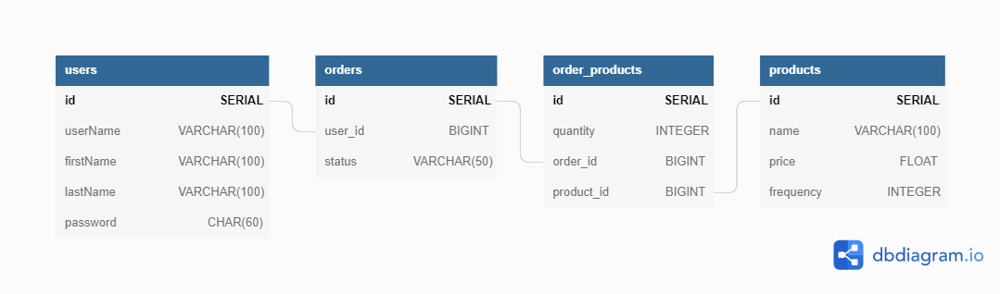

# API Requirements
The company stakeholders want to create an online storefront to showcase their great product ideas. Users need to be able to browse an index of all products, see the specifics of a single product, and add products to an order that they can view in a cart page. You have been tasked with building the API that will support this application, and your coworker is building the frontend.

These are the notes from a meeting with the frontend developer that describe what endpoints the API needs to supply, as well as data shapes the frontend and backend have agreed meet the requirements of the application. 

## API Endpoints
### Auth
|Function|URL|Method|Args|Token Required|Body|Response|
|-|-|-|-|-|-|-|
|Register|`/api/register`|`POST`|`-`|`False`|`{` `"username": "Magdi",` `"firstName": "Mohamed",` `"lastName": "Magdi"` `"password":"123"` `}`|`{` `"id": 1,` `"username": "Magdi",` `"firstName": "Mohamed",` `"lastName": "Magdi"` `}`|
|Sign in|`/api/sign-in`|`POST`|`-`|`False`|`{` `"username": "Magdi",` `"password":"123"` `}`|`{` `"token": JWTTOKEN,` `}`

#### Products
|Function|URL|Method|Args|Token Required|Body|Response|
|-|-|-|-|-|-|-|
|Index|`/api/products`|`GET`|`-`|`False`|`-`|
|Show|`/api/products/:id`|`GET`|`product id`|`False`|`-`|`[{` `"id": 1,` `"name": "TShirt",` `"price": 10,` `"frequency": 0` `}]`|
|Create|`/api/products`|`POST`|`-`|`True`|`{` `"name": "TShirt"` `,"price": 10` `}`|`{` `"id": 1,` `"name": "TShirt",` `"price": 10,` `"frequency": 0` `}`|
|Top 5 products|`/api/products/top-five`|`GET`|`-`|`False`|`-`|`[{` `"id": 1,` `"name": "TShirt",` `"price": 10,` `"frequency": 4` `},` `{` `"id": 2,` `"name": "POLO",` `"price": 16,` `"frequency": 0` `}]`|

#### Users
|Function|URL|Method|Args|Token Required|Body|Response|
|-|-|-|-|-|-|-|
|Index|`api/users`|`GET`|`-`|`True`|`-`|`[{` `"id": 1,` `"username": "Magdi",` `"firstName": "Mohamed",` `"lastName": "Magdi"` `}]`|
|Show|`api/users/:id`|`GET`|`user id`|`True`|`-`|`{` `"id": 1,` `"username": "Magdi",` `"firstName": "Mohamed",` `"lastName": "Magdi"` `}`|
|Create|`api/users`|`POST`|`-`|`True`|`{` `"username": "Magdi",` `"firstName": "Mohamed",` `"lastName": "Magdi"` `"password":"123"` `}`|`{` `"id": 1,` `"username": "Magdi",` `"firstName": "Mohamed",` `"lastName": "Magdi"` `}`|
|Orders for user|`api/users/:id/orders`|`GET`|`user id`|`True`|`-`|`{` `"id": 1,` `"user_id": "1",` `"status": "active"` `}`

#### Orders
|Function|URL|Method|Args|Token Required|Body|Response|
|-|-|-|-|-|-|-|
|Index|`/api/orders`|`GET`|`-`|`True`|`-`|`[{` `"id": 1,` `"user_id": "1",` `"status": "active"` `}]`|
|Show|`/api/orders/:id`|`GET`|`order id`|`True`|`-`|`{` `"id": 1,` `"user_id": "1",` `"status": "active"` `}`|
|Create|`/api/orders`|`POST`|`-`|`True`|`{` `"status": "active"` `}`|`{` `"id": 1,` `"user_id": "1",` `"status": "active"` `}`|
|Get products in order|`/api/orders/:id/products`|`GET`|`order id`|`True`|`-`|`[{` `"order_id": "1",` `"status": "active",` `"product_id": "1",` `"product_name": "TShirt",` `"product_price": 10,` `"quantity": 1` `}]`|
|Add a product to an order|`/api/orders/:id/products`|`POST`|`order id`|`True`|`{` `"quantity": 1,` `"product_id": 1` `}`|`{` `"id": 1,` `"quantity": 1,` `"order_id": "1",` `"product_id": "1"` `}`|

## Data Shapes
#### Product
- id
- name
- price
- frequency

#### User
- id
- userName
- firstName
- lastName
- password

#### Orders
- id
- user_id
- status (active or complete)

### Order Products
- id
- quantity
- order_id
- product_id

## Database Schema

